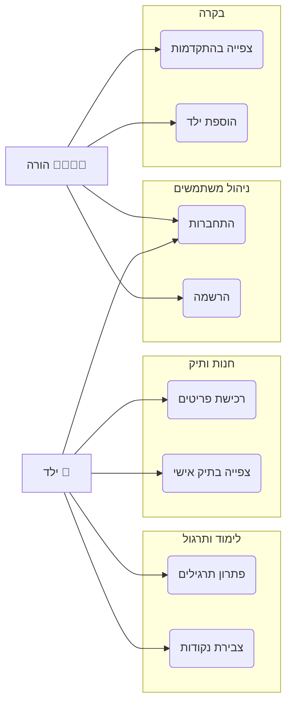

<div dir="rtl" markdown="1">

# מסמך הגשת פרויקט - החשבון של מתי (Math for Kids)

## 1. חלוקת לוחות זמנים ומשימות (מהנדס מערכת)

**מהנדס המערכת / ראש הצוות:** [השם שלך]  
**חברי הצוות:** [שמות נוספים אם יש, או "עבודה עצמאית בסיוע AI"]

### טבלת משימות שבוצעו:

| משימות שהושלמו | משימות שהוקצו | שם חבר הצוות |
| :--- | :--- | :--- |
| הוקם שרת Express, חיבור ל-Mongo Atlas, והגדרת סכמות (Users). | **ניהול וארכיטקטורה:** עיצוב בסיס הנתונים (MongoDB), הגדרת API, ניהול גיט. | **[השם שלך]** |
| פונקציות Login/Register, עדכון ניקוד, רכישה בחנות, שליפת נתונים להורים. | **פיתוח צד שרת:** לוגיקת משתמשים, אימות (Auth), לוגיקת חנות, שמירת תוצאות. | **Backend** |
| דף כניסה, משחקי חשבון, חנות הפתעות, **לוח בקרה להורים (Dashboard)**, תיק אישי. | **פיתוח צד לקוח:** עיצוב מסכים, רכיבי UI, ניהול State, גרפים. | **Frontend** |
| תיקון באגים בגרפים, התאמת כפתורים לילדים, הוספת אנימציות. | **בדיקות ועיצוב:** התאמה למובייל, בדיקת זרימת משתמש, חווית משתמש לילדים. | **QA / UI** |

*(הערה: הטבלה מסודרת כך שהעמודה הימנית היא השם, והשמאלית היא הביצוע - בהתאם לכיוון הקריאה)*

---

## 2. מסמך דרישות (Requirements)

### א. דרישות פונקציונליות (Functional Requirements)
המערכת תאפשר למשתמשים (הורים וילדים) לבצע את הפעולות הבאות:

1.  **ניהול משתמשים (Auth):**
    *   רישום והתחברות למערכת.
    *   הבחנה בין סוגי משתמשים: "הורה" ו"ילד".
    *   הורה יכול לרשום ילדים חדשים תחת חשבונו.

2.  **תרגול ולמידה (Core):**
    *   ביצוע תרגילים ב-5 נושאים: חיבור, חיסור, כפל, חילוק, ואחוזים.
    *   קבלת משוב מיידי (נכון/לא נכון) ויזואלי (קונפטי/רעד).
    *   צבירת ניקוד על תשובות נכונות ומעקב אחר טעויות.

3.  **משחוק (Gamification):**
    *   **חנות וירטואלית:** המרת נקודות שנצברו בפריטים וירטואליים (כתרים, מדליות, שיקויים).
    *   **תיק אישי (Inventory):** צפייה בפריטים שנרכשו ללא הגבלת כמות.

4.  **לוח בקרה להורים (Dashboard):**
    *   צפייה ברשימת הילדים המשויכים.
    *   **ויזואליזציה:**
        *   גרף עמודות המציג אחוזי הצלחה לפי נושא (נכון מול סה"כ).
        *   גרף השוואתי (Grouped Bar Chart) המציג את הניקוד של כל הילדים בכל נושא.
        *   טבלה מפורטת עם נתונים גולמיים.

### ב. דרישות לא פונקציונליות (Non-Functional Requirements - NFR)

1.  **שימושיות (Usability):**
    *   ממשק מותאם לילדים: כפתורים גדולים, צבעים מזמינים, שימוש באמוג'י, שפה פשוטה.
    *   רספונסיביות מלאה: עבודה תקינה במחשב, טאבלט וטלפון נייד.

2.  **ביצועים (Performance):**
    *   זמן טעינת דפים מתחת ל-2 שניות.
    *   עדכון גרפים בזמן אמת ללא צורך ברענון עמוד מלא (SPA - Single Page Application).

3.  **אמינות וזמינות (Reliability):**
    *   שמירת נתונים בבסיס נתונים עמיד (MongoDB Atlas).
    *   טיפול בשגיאות בצורה ידידותית (הודעות שגיאה בעברית ולא קריסת קוד).

4.  **אבטחה (Security):**
    *   שמירת סיסמאות (בפועל ניתן להוסיף הצפנה עם bcrypt).
    *   שימוש ב-LocalStorage לניהול Session דמוי-Token.

### ג. דרישות ממשק חיצוניות (External Interface Requirements)

1.  **ממשק משתמש (User Interface):**
    *   בנוי ב-React.js עם עיצוב מותאם אישית (Tailwind CSS).
    *   שימוש בספריית Recharts להצגת נתונים ויזואליים.

2.  **ממשק חומרה (Hardware Interface):**
    *   תמיכה במסכי מגע (משחקיות בטאבלט) ובקלדת עכבר.

3.  **ממשק תוכנה (Software Interface):**
    *   **Database:** חיבור ל-MongoDB באמצעות Mongoose.
    *   **API:** שרת RESTful ב-Node.js המגיש נתונים בפורמט JSON ללקוח.

---

## 3. סיכום תהליך העבודה (Process Summary)

תהליך הפיתוח של "החשבון של מתי" התבצע בתצורת Agile איטרטיבית, כאשר בכל שלב נוספה שכבה חדשה של פונקציונליות:

1.  **שלב הייזום והתכנון:** הגדרנו את מטרת העל - לימוד חשבון חוויתי. יצרנו wireframes בסיסיים לדפי התרגול ולדף הבית.
2.  **פיתוח הליבה (Phase 1):** הקמנו את השרת ואת בסיס הנתונים. מימשנו את דפי התרגול הבסיסיים (חיבור/חיסור) כדי לוודא שהלוגיקה המתמטית עובדת ושומרת ניקוד.
3.  **הוספת שכבת המשחוק (Phase 2):** כדי להגביר מוטיבציה, הוספנו את החנות. זה דרש שדרוג של סכמת המשתמש (User Schema) להוספת `inventory` ו-`spentPoints`. פיתחנו את דף ה-Inventory כדי שילדים יוכלו "להשוויץ" ברכישות.
4.  **פיתוח כלי להורים (Phase 3):** הבנו שיש צורך בבקרה. פיתחנו את ה-Parent Dashboard. התחלנו עם טבלה פשוטה, אך מהר מאוד עברנו לגרפים מתקדמים (Recharts). עברנו מספר איטרציות על הגרפים - מגרף רדאר, לגרף עמודות פשוט, ולבסוף לגרף אחוזי הצלחה וגרף השוואתי מורכב, לפי דרישות המשתמש לראות נתונים ברורים יותר.
5.  **ליטוש סופי:** תיקוני UI, הוספת אנימציות, וידוא רספונסיביות במובייל (תיקון תפריט הניווט), ובדיקות קצה לקצה.

התוצאה הסופית היא מערכת webית מלאה (Fullstack) המשלבת ערך חינוכי עם חווית משתמש מודרנית וכיפית.

---

## 4. דיאגרמות

### א. ארכיטקטורת המערכת (Architecture Diagram)

```mermaid
graph TD
    Client[Client (React + Tailwind)] <-->|API Calls (axios)| Server[Server (Node.js + Express)]
    Server <-->|Mongoose Queries| DB[(MongoDB Atlas)]
```

### ב. תרשים שימוש (Use Case Diagram)



</div>
